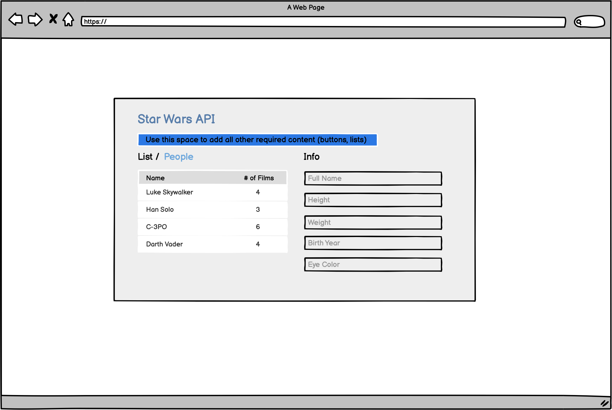

# Intro

This challenge is broken into a front end, and back end, challenge. The back end challenge involves building a simple API, which is then called on by the front end challenge, which is a simple web app using React.

The instructions for both challenges are below, starting with the node/backend challenge.

[Front End Challenge](#front-end-challenge)

**NOTE ON TYPESCRIPT:** _Typescript is setup and ready to go for the front end challenge. The back end, however, is not. For this challenge, we encourage you to use plain ole Javascript for the back end challenge, and typescript for the front end challenge._

# Requirements

- Docker
- node (v14+)
- npm (v6+)

# Node/Backend Challenge

A little exercise using a Star Wars API [https://swapi.dev/](https://swapi.dev/) and [express.js](https://expressjs.com/)

## Goal

We want to know that you can:

- Consume and manipulate API data
- Use pagination to get the complete list of all of a resource at once. (Swapi's people endpoint returns 10 at a time by default. We need the full list of 87)
- Keep the task simple. (Don't engineer for all possible future solutions, just solve the task at hand).
- Sort an array of objects.
- Replace object field values with more appropriate data.

# Setup

- First you will need to build your docker image (This assumes you already have docker installed. If not, it can be downloaded here: https://www.docker.com/products/docker-desktop/)
- Once docker is installed, run the following command to build the image: `npm run docker:build`
- To run the server, run the following command: `docker-compose up`
- To run the client, simply run `npm run client:dev`
- **Note**: By default, the client will run on port 3000, and the server on 4000

## Task

- Make an express server that exposes the following 2 endpoints

```
/people
/planets
```

- The people endpoint must return all people, and must take an optional query param "sortBy" that allows the array to be sorted by 'name', 'height', or 'mass'.

- The planets endpoint must return all planets but we would like the residents field on each planet to be replaced with the residents full names instead of the default from SWAPI which is links to each resident. (don't worry about sorting this one)
  - The default response looks like this:
  ```
  [
  	{
  		"name": "Alderaan",
  		"rotation_period": "24",
  		"orbital_period": "364",
  		"diameter": "12500",
  		"climate": "temperate",
  		"gravity": "1 standard",
  		"terrain": "grasslands, mountains",
  		"surface_water": "40",
  		"population": "2000000000",
  		"residents": [
  			"https://swapi.dev/api/people/5/",
  			"https://swapi.dev/api/people/68/",
  			"https://swapi.dev/api/people/81/"
  		],
  		"films": [
  			"https://swapi.dev/api/films/6/",
  			"https://swapi.dev/api/films/1/"
  		],
  		"created": "2014-12-10T11:35:48.479000Z",
  		"edited": "2014-12-20T20:58:18.420000Z",
  		"url": "https://swapi.dev/api/planets/2/"
  	},
  	{
  		"name": "Yavin IV",
  		"rotation_period": "24",
  		...
  	},
  	...
  ]
  ```
  - Your endpoint to return planet residents must look something like this:
  ```
  [
  	{
  		"name": "Alderaan",
  		"rotation_period": "24",
  		"orbital_period": "364",
  		"diameter": "12500",
  		"climate": "temperate",
  		"gravity": "1 standard",
  		"terrain": "grasslands, mountains",
  		"surface_water": "40",
  		"population": "2000000000",
  		"residents": [
  			"Leia Organa",
  			"Bail Prestor Organa",
  			"Raymus Antilles"
  		],
  		"films": [
  			"https://swapi.dev/api/films/6/",
  			"https://swapi.dev/api/films/1/"
  		],
  		"created": "2014-12-10T11:35:48.479000Z",
  		"edited": "2014-12-20T20:58:18.420000Z",
  		"url": "https://swapi.dev/api/planets/2/"
  	},
  	{
  		"name": "Yavin IV",
  		"rotation_period": "24",
  		...
  	},
  	...
  ]
  ```

# Front End Challenge

_**NOTE:** The project is a simple vite powered React app. If for whatever reason the pre-built starter does not work, the following command will generate a new vite project: `npm create vite@3.1.0`_

.

For this programming test you are tasked with creating an interface around
the open API created as part of the node section of this challenge.

In your client side application, you will be making use of two of the endpoints that are offered:

- /people
- /planets

Your application should allow the user to:

- Select if they would like to search by planet or person
- Select which planet or person to return results for
- View a results list after #1 and #2 have been selected
- Display the name for person/planet, as well as the number of films they have appeared in
- View more information about the planet/person by clicking on the name in the results list (hair color, eye color, birth year, home planet etc.), with 5 fields minimum

Your website should be built using React and match the following design.
Feel free to use whatever libraries you want to make the design fit.

Priorities:

1. Functionality
2. Design
3. Code organization
4. Proper error handling (make sure they select something before clicking on the button to fetch results)

If you have any questions, please let us know.



## Available endpoints:

** _NOTE: The following endpoint responses are not exact, but truncated examples; Results may vary_ **

### `/people/`

> Get all the people resources

**response**

```json
{
    "count": 82,
    "next": "https://swapi.dev/api/people/?page=2",
    "previous": null,
    "results": [
        {
            "name": "Luke Skywalker",
            "height": "172",
            "mass": "77",
            "hair_color": "blond",
            "skin_color": "fair",
            "eye_color": "blue",
            "birth_year": "19BBY",
            "gender": "male",
            ...
        },
        {
            "name": "C-3PO",
            "height": "167",
            "mass": "75",
            "hair_color": "n/a",
            "skin_color": "gold",
            "eye_color": "yellow",
            "birth_year": "112BBY",
            "gender": "n/a"
            ...
        },
```

### `/people/:id`

> _:id_ must be a number

**response**

```json
{
  "name": "Luke Skywalker",
  "height": "172",
  "mass": "77",
  "hair_color": "blond",
  "skin_color": "fair",
  "eye_color": "blue",
  "birth_year": "19BBY",
  "gender": "male",
  "homeworld": "https://swapi.dev/api/planets/1/",
  "films": [
    "https://swapi.dev/api/films/1/",
    "https://swapi.dev/api/films/2/",
    "https://swapi.dev/api/films/3/",
    "https://swapi.dev/api/films/6/"
  ],
  "species": [],
  "vehicles": [
    "https://swapi.dev/api/vehicles/14/",
    "https://swapi.dev/api/vehicles/30/"
  ],
  "starships": [
    "https://swapi.dev/api/starships/12/",
    "https://swapi.dev/api/starships/22/"
  ],
  "created": "2014-12-09T13:50:51.644000Z",
  "edited": "2014-12-20T21:17:56.891000Z",
  "url": "https://swapi.dev/api/people/1/"
}
```

### `/planets/`

> Get all the planet resources

**response**

```json
{
    "count": 60,
    "next": "https://swapi.dev/api/planets/?page=2",
    "previous": null,
    "results": [
        {
            "name": "Tatooine",
            "rotation_period": "23",
            "orbital_period": "304",
            "diameter": "10465",
            "climate": "arid",
            "gravity": "1 standard",
            ...
        },
        {
            "name": "Alderaan",
            "rotation_period": "24",
            "orbital_period": "364",
            "diameter": "12500",
            "climate": "temperate",
            "gravity": "1 standard",
            ...
        },
      ...
    ]
}
```

### `/planets/`

> _:id_ must be a number

**response**

```json
{
    "climate": "Arid",
    "created": "2014-12-09T13:50:49.641000Z",
    "diameter": "10465",
    "edited": "2014-12-15T13:48:16.167217Z",
    "films": [
        "https://swapi.dev/api/films/1/",
        ...
    ],
    "gravity": "1",
    "name": "Tatooine",
    "orbital_period": "304",
    "population": "120000",
    "residents": [
        "https://swapi.dev/api/people/1/",
        ...
    ],
    "rotation_period": "23",
    "surface_water": "1",
    "terrain": "Dessert",
    "url": "https://swapi.dev/api/planets/1/"
}
```

## Bonus

Add some tests!

We primarily use jest and mocha+chai, but you're free to use whatever you want.

Or you can skip this part.
